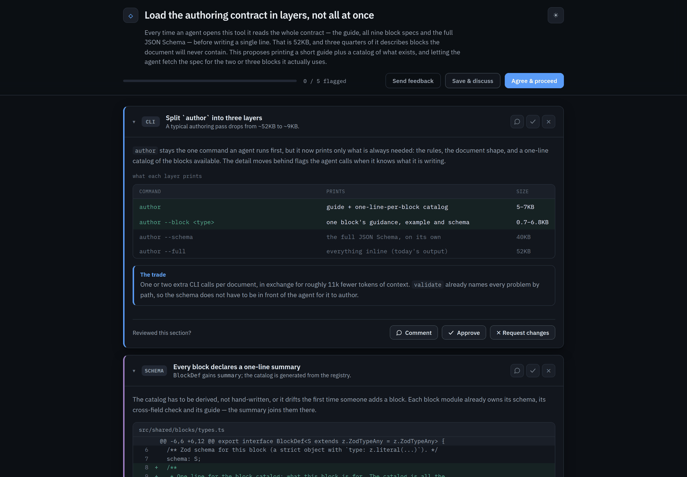
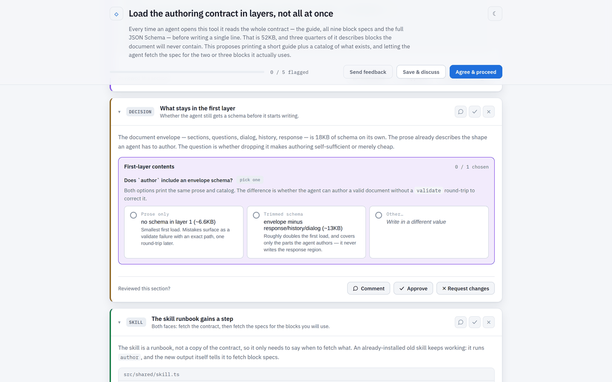
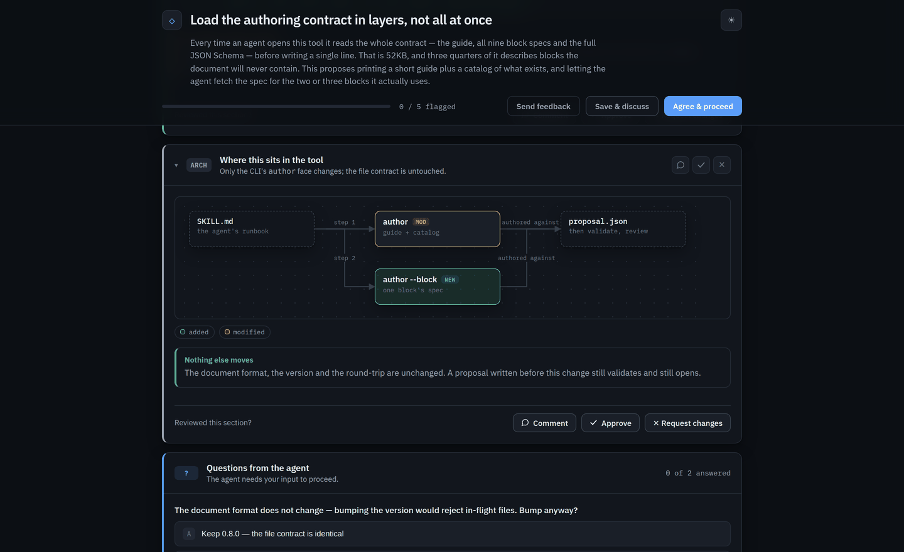
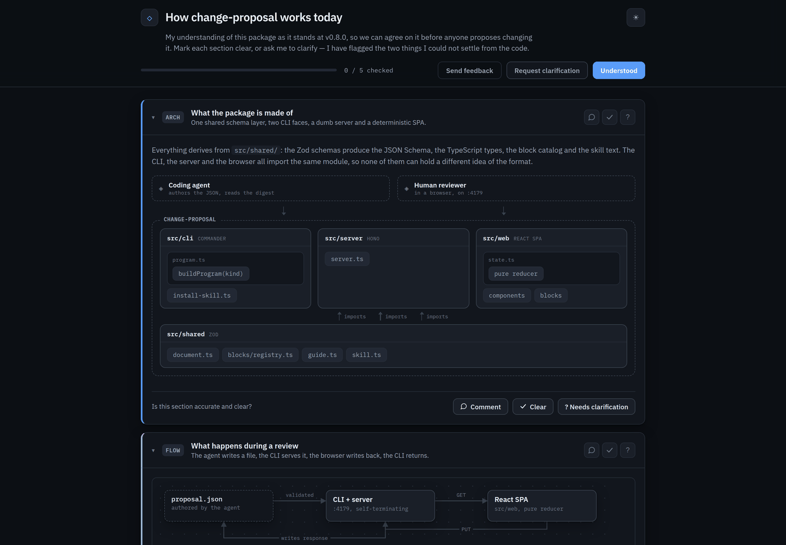
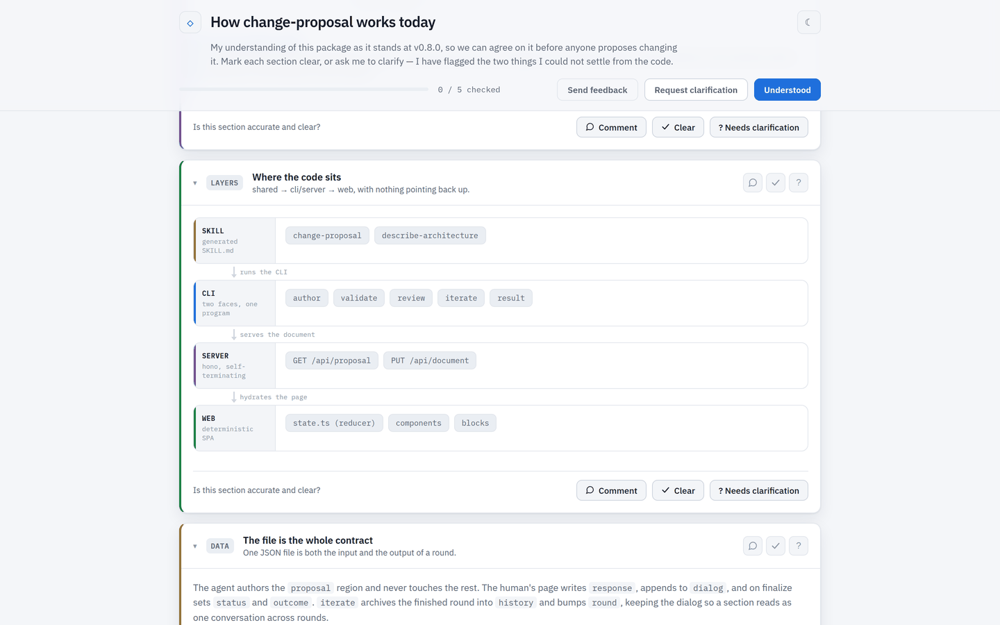

# change-proposal

An interface for coding assistants to generate **change proposal pages** — a structured,
section-by-section approval gate that sits between an agent's plan and its execution,
replacing "read this markdown plan".

The agent breaks a proposed change into reviewable sections (schema, logic, code diffs,
API, types, UI, tests, deps, build) plus open questions; the human approves/rejects each
section, leaves per-section comments, answers the agent's questions, and resolves
conflicts — all routed back to the agent via a single JSON file. **The review page itself
is the product**; the sample payload (a Google Tasks 3-way-merge fix) is just an example.

## What it looks like

Both pages below are real output from this repo — a proposal about the tool's own
authoring contract, and a description of the tool's own architecture. The documents behind
them are in `docs/examples/`, so you can open either one yourself:

```bash
npm run build                                                              # once
npm run cli -- review docs/examples/layered-contract.proposal.json
npm run describe -- review docs/examples/current-architecture.description.json
```

The page writes the human's side back into the file it was given, so copy one out of
`docs/examples/` before clicking through it if you want to keep the original.



The sticky header carries the title, the description, review progress and the two finalize
buttons. Each section is a card the human approves or sends back, with the agent's blocks
inside it — here prose, a table and a callout.



A `conflict` block is the one block that collects an answer: the reviewer picks a side (or
writes their own), and the pick comes back to the agent in `response.resolutions`.



Diagrams are authored as data — nodes and edges, never coordinates — and laid out by the
page. Below the sections, the agent's questions are answered inline.

## Two faces, one package

The document carries a `kind`, and the same CLI, schema, blocks and page serve both. Each
face has its own bin and its own skill; a file of the wrong kind is refused, not coerced.

| | `change-proposal` | `describe-architecture` |
| --- | --- | --- |
| The agent presents | a change it proposes to make | the system as it is today |
| The human does | approve or request changes, per section | mark each section clear, or ask for clarification |
| Per-section verdict | `approved` / `rejected` | `clear` / `needs-clarification` |
| Outcome | `approved` (agree & proceed) or `discuss` (save & iterate) | `understood` (shared context) or `clarify` (another round) |
| Default file | `proposal.json` | `architecture.json` |
| In-repo script | `npm run cli -- …` | `npm run describe -- …` |

`describe-architecture` is the loop for agreeing on how the system works today, before
anyone proposes changing it: the agent writes up its understanding — usually `arch-flow`,
`arch-layers`, `arch-boundaries` and `er` blocks with `markdown` around them — and anything
it could not verify from the code goes in `questions` instead of being asserted. The human
marks each section clear or asks for clarification; the questions come back as `dialog`
threads the agent answers in the next round, until you both hold the same model of the
system. All kind-dependent wording lives in `src/web/copy.ts`.



Same page, different loop: the buttons read **Understood** and **Request clarification**,
progress counts sections checked, and each card asks whether it is accurate and clear.



Every block works in either kind, and the whole page has a light theme as well as the dark
default.

## Requirements

- **Node ≥ 20** (developed on Node 26; Vite 6 needs a modern Node).
- npm.

## Setup

```bash
npm install
```

If `tsx`/`vite` fail right after install, esbuild's binary didn't finish its install
script — rebuild it:

```bash
npm rebuild esbuild
```

When you add or bump a dependency, run `npm audit` and clear what it reports before
committing — the first cut shipped with known vulnerabilities, so a clean audit is part of
"done" for any dependency change. This is meant to stay a small, few-dependency package.

## Commands

| Command | What it does |
| --- | --- |
| `npm run build` | Build the SPA to `dist/web/` — **required before `review` can serve the UI**. |
| `npm test` | Run the deterministic-reducer golden tests (`src/web/state.test.ts`), the block schema-validation tests (`src/shared/blocks/blocks.test.ts`) and the guide/skill contract tests. |
| `npm run typecheck` | `tsc --noEmit`. |
| `npm run cli -- author` | Print the versioned authoring guide + block catalog (what the skill fetches). See [The authoring contract](#the-authoring-contract). Use `--silent` on `npm run` to keep stdout clean. |
| `npm run cli -- example proposal.json` | Write a sample proposal you can adapt. |
| `npm run cli -- validate proposal.json` | Validate a proposal against the schema + version. |
| `npm run cli -- review proposal.json` | Validate, serve the UI on `:4179`, and block until you finalize in the browser. |
| `npm run cli -- result proposal.json` | Re-print the agent-readable digest of a finished round (ids joined back to labels). |
| `npm run cli -- iterate proposal.json` | Start the next round: archive the response into `history`, keep `dialog`, bump `round`. |
| `npm run cli -- install-skill --all` | Install the agent skills into `~/.claude/skills/` (see below). |

Every command above has a `describe-architecture` twin — same verbs, same flags, on the
other kind:

```bash
npm run describe -- author                       # the description authoring guide
npm run describe -- example architecture.json    # a sample description to adapt
npm run describe -- review architecture.json     # serve the page, wait for the human
```

## The authoring contract

`author` is what an agent reads before writing a document, and it is disclosed in layers so
the agent loads only what it needs — the whole contract inline is ~52KB, three quarters of
it schema for blocks a given document never contains.

| Command | Prints | Size |
| --- | --- | --- |
| `author` | The guide — rules, document shape, sections, questions, dialog, iterating, reading the result — plus a one-line-per-block catalog. | 5–7KB |
| `author --block <type>[,<type>]` | One block's spec: its guidance, a JSON example, and its schema fragment. An unknown type is an error naming the known ones. | 0.7–6.8KB each |
| `author --schema` | The full JSON Schema, on its own. | ~40KB |
| `author --full` | The guide with every block spec and the schema inline. | ~52KB |

A typical pass costs ~9KB instead of ~52KB. `validate` names every problem by path, so the
schema does not have to be in the agent's context for it to author against.

## Installing the skills

The skills are how an agent reaches this tool. `install-skill` writes them for you, wired to
invoke this checkout from any directory:

```bash
npm run cli -- install-skill --all                    # ~/.claude/skills — every project
npm run cli -- install-skill --all --project          # ./.claude/skills — this project only
npm run cli -- install-skill --all --agent cursor     # ~/.cursor/skills — Cursor
npm run cli -- install-skill --all --agent claude,cursor
```

Both skills are **explicit-invocation only** (`disable-model-invocation: true`): you open a
review by typing `/change-proposal` or `/describe-architecture`, and the agent never decides
to on its own. Opening a review starts a blocking server and takes over your browser, which
is not something an agent should choose for you. Claude Code and Cursor honour the same field.

`SKILL.md` is a shared convention, so the generated file is byte-identical for every host —
only the directory differs:

| `--agent` | User scope | Project scope | Read by |
| --- | --- | --- | --- |
| `claude` (default) | `~/.claude/skills/` | `./.claude/skills/` | Claude Code — and Cursor, which loads the Claude directories for compatibility. |
| `cursor` | `~/.cursor/skills/` | `./.cursor/skills/` | Cursor (its native location; any depth inside a repo works). |
| `agents` | `~/.agents/skills/` | `./.agents/skills/` | The vendor-neutral path — Cursor and Codex read it; Claude Code does not. |

So a Cursor user is covered either way, but `--agent cursor` puts the skill where Cursor
itself documents it. Combine hosts with a comma to install to several at once.

| Option | What it does |
| --- | --- |
| `--agent <names>` | Host convention(s) to install for, comma-separated (see table above). |
| `--user` | Install to the user-level dir (the default; the Claude host honours `CLAUDE_CONFIG_DIR`). |
| `--project` | Install to the project-level dir in the current directory. |
| `--dir <path>` | Install to an explicit skills directory (for a host not listed above). Can't be combined with `--agent`. |
| `--all` | Install both skills. Without it, each bin installs only its own (`change-proposal install-skill` → the proposal skill, `describe-architecture install-skill` → the description skill). |
| `--command <cmd>` | Command the installed skill should invoke. Defaults to the bin name when it's on `PATH` (i.e. after `npm link`), otherwise the absolute path to this checkout's bin. |
| `--force` | Overwrite an existing `SKILL.md` whose content differs. Without it, a differing file is reported and left alone. |
| `--print` | Print the `SKILL.md` instead of writing it. |
| `--local` | Emit the in-repo `npm run` form — this is how this repo's own `.claude/skills/` files are regenerated. |

Re-running is idempotent (`already current`), so re-run it after pulling a new version to
keep the installed skills in step with the tool. The skill text is generated from
`src/shared/skill.ts`, so an installed skill can't drift from the checked-in one — a test
pins the two together.

### Reviewing on a remote/headless box

`review` tries to open a browser but never requires one. Forward the port and open it
locally:

```bash
ssh -L 4179:localhost:4179 <host>   # then browse to http://localhost:4179
```

The review page is also drivable over plain HTTP (`GET /api/proposal`, `PUT /api/document`)
— handy for scripted/headless round-trips.

## How the pieces fit

```
skill  →  CLI (author / review)  →  dumb self-terminating Hono server  →  React SPA
```

- **`src/shared/`** — the single source of truth. Zod schemas derive the JSON Schema, the
  TS types, the block catalog and the skill's authoring guide. Node-safe (no React).
- **`src/shared/blocks/`** — one module per block: schema, cross-field `check`, catalog
  `summary` and authoring guide, all registered in `registry.ts`. Adding a block means
  adding a module there and a renderer keyed by the same `type` in `src/web/blocks/`.
- **`src/web/state.ts`** — a pure reducer (no React, no time, no I/O); `finalizedAt` is
  stamped by the server, never the reducer. Pinned by the golden tests.
- **`src/server/` + `src/cli/`** — a dumb I/O server that guards the proposal region as
  byte-identical read-only, plus the CLI. `buildProgram(kind)` builds both faces from one
  program, so the two bins can't drift apart.
- **`.claude/skills/change-proposal/` and `.claude/skills/describe-architecture/`** — the
  two skills that drive the flow. Generated from `src/shared/skill.ts`; `install-skill`
  writes the same text elsewhere with the invocation rewritten.

## Docs

- **`specs/change-proposal-spec.md`** — implementation decisions (architecture, data
  model, versioning, round-trip, v1 scope). This is the contract.
- **`design_handoff/`** — the hifi visual/behavioral reference. Read
  `design_handoff/README.md` first; open `Change Proposal.standalone.html` in a browser to
  click through the real design.
- **`CLAUDE.md`** — guidance for Claude Code working in this repo (architecture invariants).

## Status

**v0.8.0** (past the spec's §7 first cut). On top of the first cut it now threads a
per-section conversation across rounds (`dialog`), archives prior rounds into `history`,
and finalizes to one of two outcomes — `approved` (agree & proceed) or `discuss` (save &
iterate). Blocks implemented: `markdown`, `diff`, `callout`, `conflict` — the first
**input-collecting** block (side-by-side decisions whose picks land in
`response.resolutions`, soft-gated so they never block finalize; each field carries a
`description` and each side an optional `note` so the decision explains itself) — `table`
(a generic toned grid the `er` block's Columns tab reuses, and the logic section's
decision table too), `er` (the DB-diagram block: an auto-laid-out entity-relationship
diagram with PK/FK/UQ/IDX field rows, a green changed-entity treatment, FK-hover
highlighting, cardinality glyphs at the connector ends, and an optional `columns` table
that enables the Diagram/Columns tabs), and three architecture diagrams (`arch-flow`,
`arch-layers`, `arch-boundaries`). A second document `kind`,
`architecture-description`, drives the `describe-architecture` face — same file format
and blocks, a clarification loop instead of an approval gate. The authoring contract is
disclosed in layers (`author` → `author --block <type>`), so an agent loads the specs for
the blocks it will actually use. The handoff's modal conflict treatment remains deferred.
